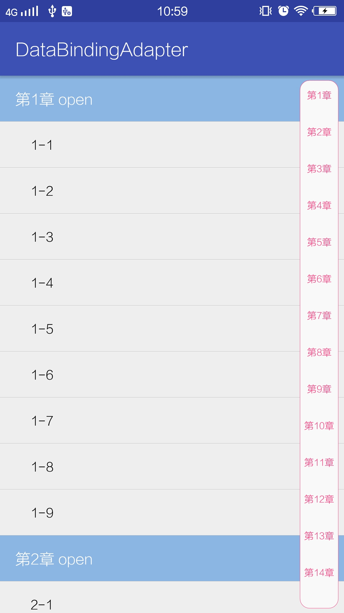
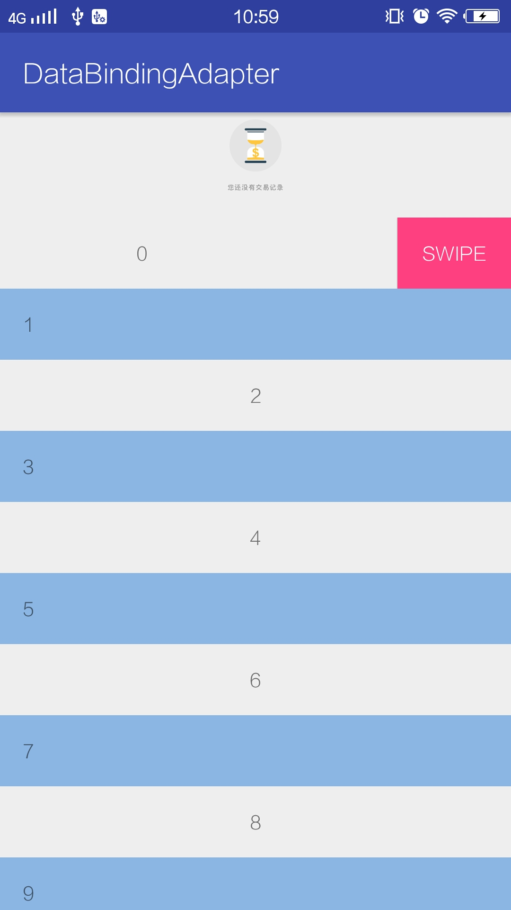
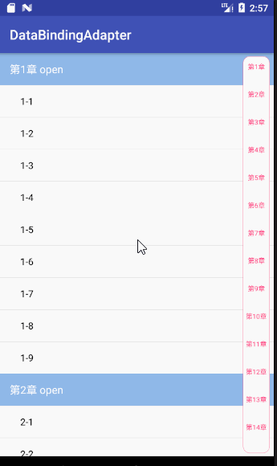
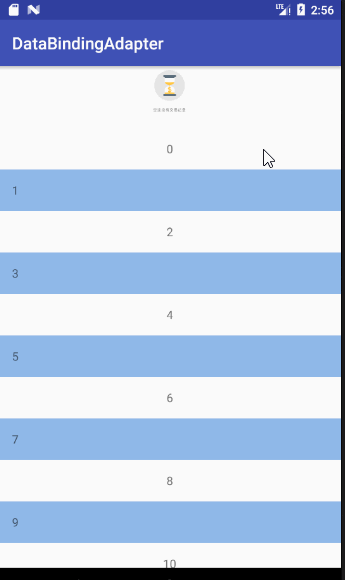

# DataBindingAdapter
基于data binding的RecyclerView adapter封装，支持侧边栏快速跳转，StickyHeader

## Feature ##
1. multiple type view
2. at the bottom of the load more
3. add WaveSideBar for quick jump list
4. support snap and sticky header
5. support SwipeItemView

## ScreenShot ##
</img> </img> </img> </img>

## Thanks ##
[AndroidSwipeLayout](https://github.com/daimajia/AndroidSwipeLayout)  
[WaveSideBar](https://github.com/Solartisan/WaveSideBar)  
[RecyclerItemDecoration](https://github.com/dinuscxj/RecyclerItemDecoration)  
[RecyclerViewSnap](https://github.com/rubensousa/RecyclerViewSnap)

## How to use ##

### user it for multiple type and load more ###
    @Override
    protected void onCreate(Bundle savedInstanceState) {
        super.onCreate(savedInstanceState);
        setContentView(R.layout.activity_multi_type);
        recyclerView = (RecyclerView) findViewById(R.id.rv);
        init();
        adapter = new TextAdapter(itemArray);
        adapter.openLoadMore(true);
        adapter.setOnLoadMoreListener(this);
        recyclerView.setLayoutManager(new LinearLayoutManager(this));
        recyclerView.setAdapter(adapter);

    }

    private void init(){
        itemArray = new ItemArray();
        itemArray.add(new ItemData(BaseRecyclerViewAdapter.TYPE_HEADER, new HeadModel(R.mipmap.jd_l_norecord_icon)));
        for (int i = 0; i < 10; i++){
            itemArray.add(new ItemData( i % 2 == 0 ? TextAdapter.TYPE_TEXT_1 : TextAdapter.TYPE_TEXT_2, new TextData(i + "")));
        }
        itemArray.add(new ItemData(BaseRecyclerViewAdapter.TYPE_LOADING, new LoadModel(false, "loading")));
    }

    @Override
    public void onLoadMoreRequested() {
        recyclerView.postDelayed(new Runnable() {
            @Override
            public void run() {
                List<TextData> datas = new ArrayList<>();
                for (int i = 0; i < 2; i++){
                    datas.add(new TextData(i + 10 + ""));
                }
                if (page == 3){
                    adapter.openLoadMore(false);
                    Log.d("test", "close");
                    LoadModel model = (LoadModel) itemArray.get(itemArray.size() - 1).getData();
                    model.setNoData(true);
                    model.setTip("没有更多数据了");
                }
                adapter.notifyDataChangedAfterLoadMore(TextAdapter.TYPE_TEXT_1, datas);
                page ++;
            }
        }, 1000);
    }
  
adpter  

    public static final int TYPE_TEXT_1 = 1;
    public static final int TYPE_TEXT_2 = 2;

    public TextAdapter(ItemArray itemArray) {
        super(itemArray);
        addItemType(TYPE_TEXT_1, R.layout.item_text);
        addItemType(TYPE_TEXT_2, R.layout.item_text_2);
    }

    @Override
    protected void onBindDefViewHolder(BaseViewHolder holder, ItemArray itemArray, int position, int viewType) {
        super.onBindDefViewHolder(holder, itemArray, position, viewType);
        
    }

    @Override
    protected void initItemListener(final BaseViewHolder vh, int viewType) {
        super.initItemListener(vh, viewType);
    }

### use sticky header and side bar ###
    @Override
    protected void onCreate(@Nullable Bundle savedInstanceState) {
        super.onCreate(savedInstanceState);
        setContentView(R.layout.activity_sticky_header);
        mRecyclerView = (RecyclerView) findViewById(R.id.recycler_view);
        mSideBarView = (WaveSideBarView) findViewById(R.id.side_view);
        initArray();
        mRecyclerView.setLayoutManager(new SnappingLinearLayoutManager(this));
        mRecyclerView.setAdapter(new StickyHeaderAdapter(mItemArray, this));
        StickyHeaderDecoration decoration = new StickyHeaderDecoration(StickyHeaderAdapter.TYPE_CHAPTER);
        mRecyclerView.addItemDecoration(decoration);
        mRecyclerView.addOnItemTouchListener(new StickyHeaderTouchListener(this, decoration, this));
        DefaultItemAnimator animator = new DefaultItemAnimator() {
            @Override
            public boolean canReuseUpdatedViewHolder(RecyclerView.ViewHolder viewHolder) {
                return true;
            }
        };
        mRecyclerView.setItemAnimator(animator);
        new GravitySnapHelper(Gravity.TOP).attachToRecyclerView(mRecyclerView);
        mSideBarView.setOnTouchLetterChangeListener(new WaveSideBarView.OnTouchLetterChangeListener() {
            @Override
            public void onLetterChange(String letter) {
                int size = mItemArray.size();
                for (int i = 0; i < size; i++) {
                    ItemData data = mItemArray.get(i);
                    if (data.getDataType() == StickyHeaderAdapter.TYPE_CHAPTER) {
                        Chapter chapter = data.getData();
                        if (chapter.name.startsWith(letter)) {
                            mRecyclerView.smoothScrollToPosition(i);
                            return;
                        }
                    }
                }
            }
        });
    }

    private void initArray() {
        mItemArray = new ItemArray();
        for (int i = 1; i < 15; i++) {
            Chapter chapter = new Chapter("第" + i + "章", 9);
            mItemArray.add(new ItemData(StickyHeaderAdapter.TYPE_CHAPTER, chapter));
            for (int j = 1; j < 10; j++) {
                Section section = new Section(i + "-" + j);
                chapter.sections.add(section);
                mItemArray.add(new ItemData(StickyHeaderAdapter.TYPE_SECTION, section));
            }
        }
    }
